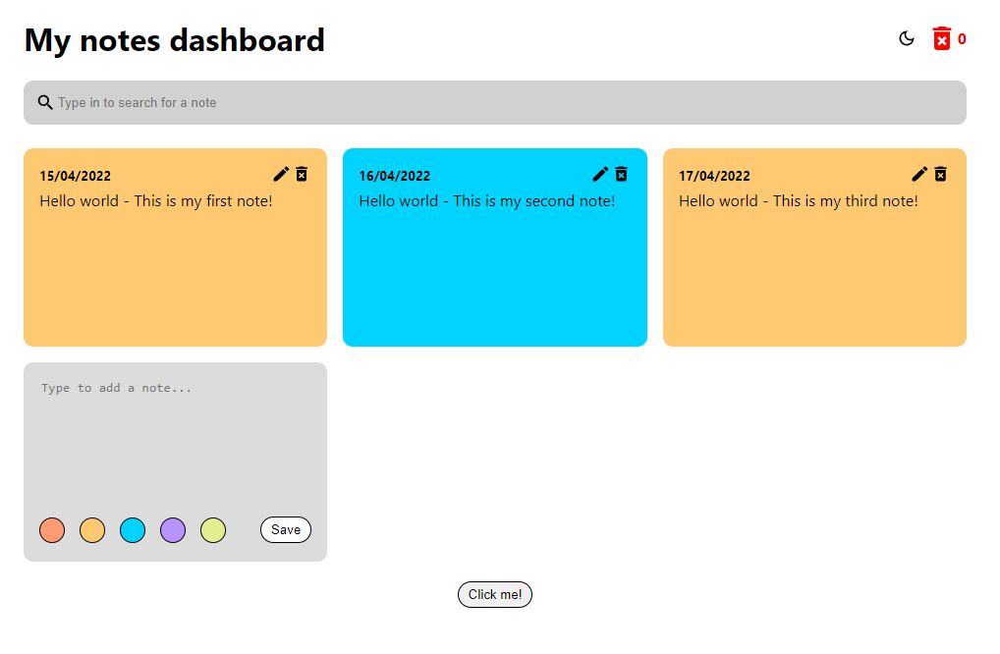
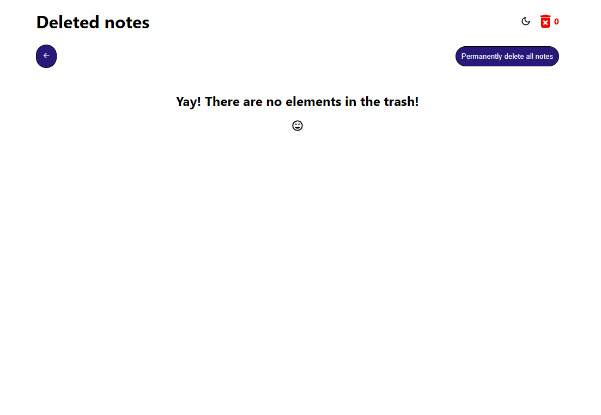

# Post-It Notes App 📝
This project was intended to be a tool for taking notes, simulating paper Post-It's for a coding-challenge.

> It was bootstrapped with [Create React App](https://github.com/facebook/create-react-app).

## Table of Contents
* [Available Scripts](#available-scripts)
* [Features](#features)
* [Screenshots](#screenshots)
* [Dependencies](#dependencies)
* [Project Status](#project-status)
* [Room for Improvement](#room-for-improvement)
* [Acknowledgements](#acknowledgements)
* [Contact](#contact)

## Available Scripts
In the project directory, you can run:

### `npm start`

Runs the app in the development mode.\
Open [http://localhost:3000](http://localhost:3000) to view it in your browser.

The page will reload when you make changes.

You may also see any lint errors in the console, and fix them by running:

### `npm run eslint`

## Features
- As a user, I can create a new Post-It.
- As a user, I can see all Post-Its in the workspace.
- As a user, I can edit a Post-It.
- As a user, I can move a Post-It to the trash bin.
- As a user, I can open the trash bin to see all Post-Its that have been moved there.
- As a user, I can move a Post-It from the trash bin to the workspace.
- As a user, I can permanently delete all Post-Its in the trash bin.
- As a user, I can see if the trash bin has Post-Its by looking the trash bin icon.
- As a user, all Post-Its in the workspace and trash bin are saved in LocalStorage.

## Screenshots
### Dashboard page

### Trash page

## Dependencies
**Redux:**
- "react-redux": This project has an intended React Redux's integration with React components. 
- "@reduxjs/toolkit": This toolkit includes several utility functions that simplify the most common Redux use cases, avoiding repetitive code and enabling the reuse of code.

**Jest:**
- "@testing-library/jest-dom": This package provides a set of custom Jest matchers that could make tests clearer to read and to maintain. This project includes Unit Tests using Jest.
- "@testing-library/react": This particular package was chosen as it provides light utility functions on top of react-dom and react-dom/test-utils, in a way that encourages better testing practices.
- "@testing-library/user-event": This library for instance, tries to simulate the real events that would happen in the browser as the user interacts with it.

**ESLint:**
- "eslint": This package is known for its utility at identifying and reporting on patterns in JavaScript. It was of much help during the development in this project, due to the config established.
- "eslint-config-airbnb": This package provides Airbnb's .eslintrc as an extensible shared config. It was chosen as part of a requirement in the coding challenge.

**Nano ID:**
- "nanoid": This package serves as a unique string ID generator for JavaScript. In this particular project, it was used to generate a unique 'id' to identify the notes.

**PropTypes:**
- "prop-types": This package was used as a way of checking props passed to the components in the projects against the definitions made, and in case they wouldn't match it would show a warning.

**React:**
- "react-dom": This package serves as the entry point to the DOM and server renderers for React.
- "react-icons": This package allows to include icons in React projects in an easy way, which utilizes ES6 imports, permiting to include only the icons that your project is using. In this current project, icons were used for the note itself, the edit and delete icons, and the happy icon in the trash page as well.
- "react-router-dom": The react-router-dom package contains bindings for using React Router in web applications. It was used in this project to divide in two different routes: Dashboard and Trash. 
- "react-scripts": This package includes scripts and configuration used by Create React App.
- "web-vitals": Web Vitals are a set of useful metrics that aim to capture the user experience of a web page. In Create React App, this third-party library is used to measure these metrics (web-vitals).

**Tailwindcss:**
- "tailwindcss": This library serves as a CSS framework for building custom user interfaces, in this project was applied to different components with that purpose.
- "autoprefixer": It is PostCSS plugin to parse CSS and add vendor prefixes to CSS rules.
- "postcss": PostCSS is a tool for transforming styles with JS plugins.

## Project Status
The current project is in progress.
> Despite the coding challenge will be over, new features could be added to the project soon.

## Room for Improvement
To do:
- Zoom in or out page text for accesibility purposes.
- Add a language picker at the top of the page that supports at least 2 more languages.

## Acknowledgements
- This project was inspired by the real methodology of using Post-It's and having fun while being organized.
- This project was based on [these requirements](https://moove-it.github.io/bootcamp/pages/challenge.html).
- Many thanks to my tutors during the bootcamp [@virginia-rodriguez](https://github.com/virginia-rodriguez) and [@ceciliagu](https://github.com/ceciliagu).

## Contact
Created by [@micadecolonia](https://github.com/micadecolonia) - feel free to contact me!
